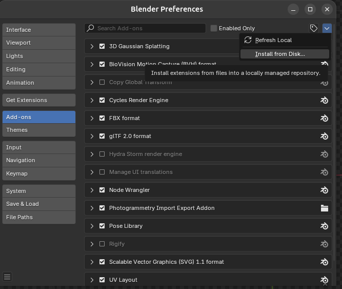
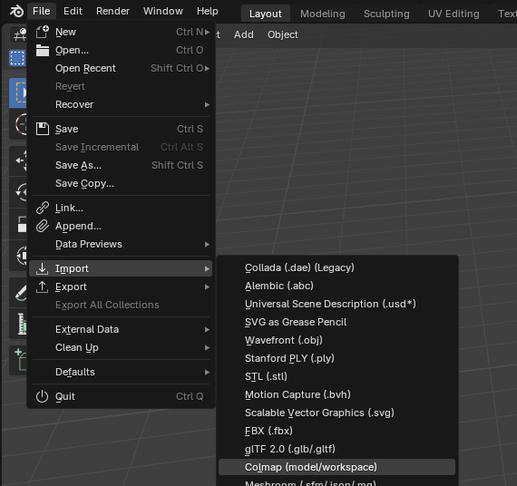
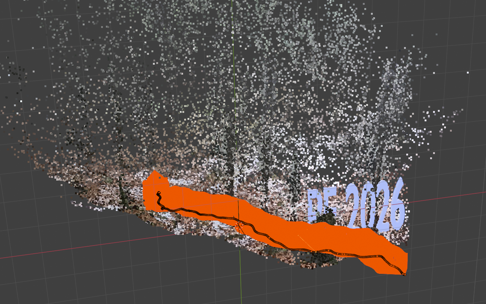
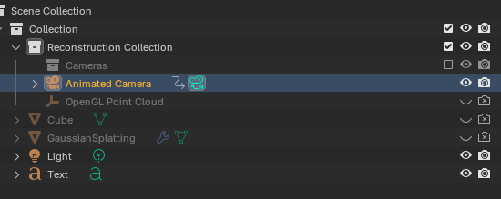

# Blender Usage

Here we cover how to import and use the colmap-file structure in blender:

* Colmap Addon Installation
* Colmap Import

## Colmap Addon Installation

The first step is to install blender photogrammetry plugin from:

* https://github.com/SBCV/Blender-Addon-Photogrammetry-Importer

Go to the releases and download the zip archive:

  * https://github.com/SBCV/Blender-Addon-Photogrammetry-Importer/releases/download/v2024.01.18/photogrammetry_importer.zip

Now, back in blender go to: Edit > Prefencs and under Addon, select _Install From Disk_, select the zip file you just downloaded:

 Now, under File > Import, there should be:

  * Stnaford PLY (ply)
  * COLMAP (model/workspace)

## Colmap Import

Now import the colmap file structure using File > Import > Colmap menu:

Import the `Scenes/<movie>/sparse/0` directory, similar scene like in this picture should appear:

---
Note: In case of not seeing the point cloud make sure you've :
* Blender 4.x, unfortunately Blender 5 is not supported when writting this text
* OpenGL Render (do not use vulkan)
---
Typically, we can hide the point cloud and the cameras and select the animated camera:

Now, by clicking `0` on numpad we select the animated camera and by pressing `Space` key we can play the animation. 