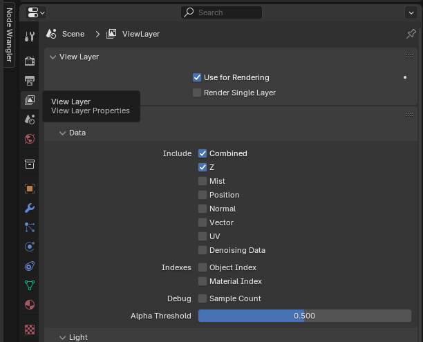
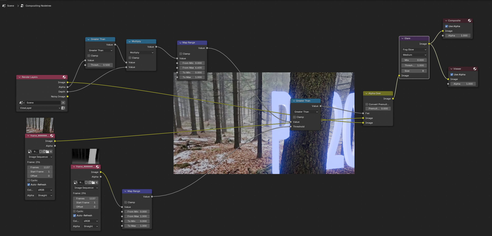
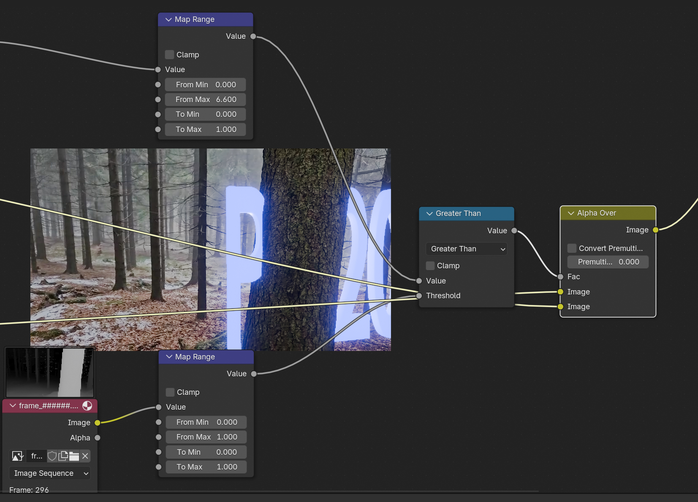
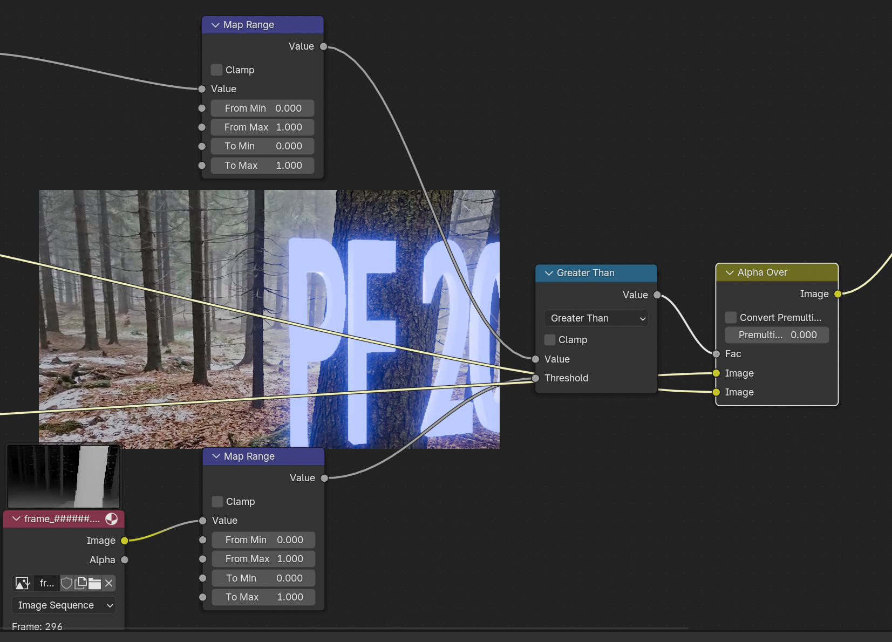
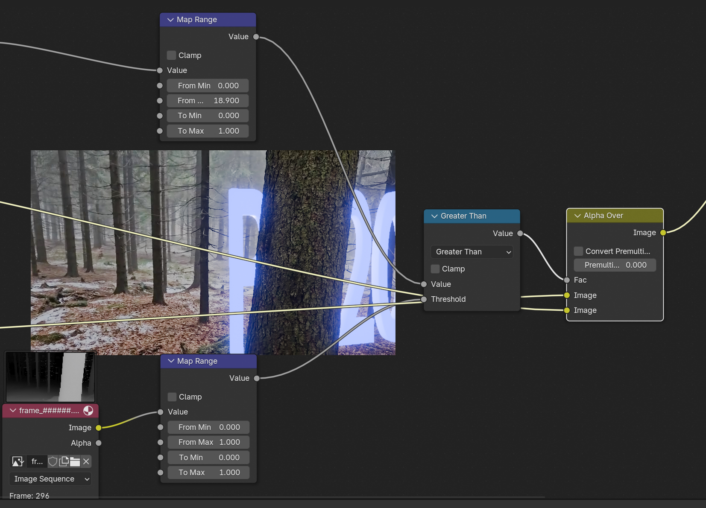

# Using Depth Maps in Blender

Should you choose the depth maps generation using the `video-depth.py` command we need to setup nodes for the compositor. This approach is especially handy for parallax like camera movement. Depending on the occlussion and the 3d render this approach might be useful for many other cases as well. It does not work well when the camera is moving _forward_ and generating _proxy geometry_ would work much better in that scenario. Depth maps will simplify cases where the video occlusion is complex (trees with branches and lots of twigs). In such cases the proxy geometry creation would be complex. Still, one can combine depth maps with very simplified proxy geometry to get shadows, light reflections, etc. using simplified geometry surfaces (like cylidner for trees, cubes for walls, etc).

## Colmap Addon Installation

See [Addon Installation](BlenderAddonAndImporting.md)

## Render Settings

Time to create some  3D object we want to mix (out-of-scope here), so the assumption is that we have something, I clicked the text, edit mode and write PF 2026, create material in shader editor and use emission color and strength. That's all. The important thing is to _enable z-pass_ in View Layer properties:

and set transparent background in Render > Film properties:

We can hit `F12` to render some image and we should see text with transparent background. 

## Compositor Node Setup 

Now let's move into the compositor and do the setup where we mix render, movie and depth maps alltogether:

On the left side we see:

 * the Render image (Z-pass enabled, so depth is available for processing)
 * Video as image sequence of RGB images
 * Depth as image sequence of 16bit depth maps (in png format)

 Since we chose the have transparent background, the depth makes sense only where alpha > 0.5, let's call it depth adjustment based on alpha channel, of course, the threshold can be changed from 0.5 to whatever makes sense in your scene:

 

 Now we have the map range from both the render-depth and video depth images, we can simply compare the depth and do the final alpha over and this is basically what composes our final image:

 

 To adjust the _depth illusion_ we can ajust the _From Max_ value to whatever suites our scene better, in this case, examples for:
 *  `1.0`  - text in front of everyhing from video
 * `18.9`  - text behind the _front big_ tree
 
 are demonstrated here:

 
 

