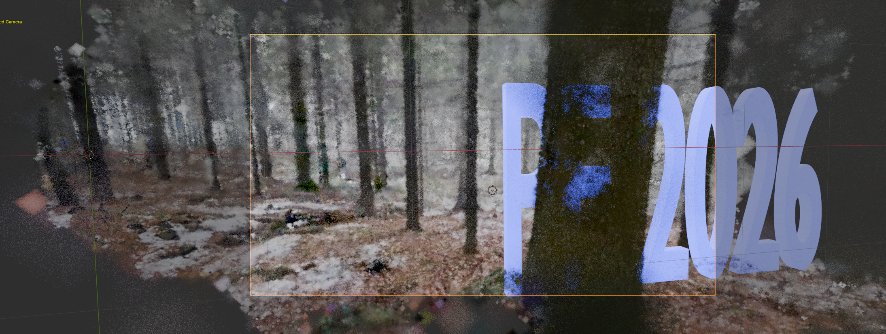

# Gaussian Splatting 

Gaussian Splatting is useful in sitauations where we have some camera track, but we would prefer alternative camera path. The gaussian splats are not a geometry by itself, so unless we are able to reconstruct meshes
from the dense point cloud we only have points (gaussian splats) where the original dense point cloud is.
This is the main limitation of Gaussian Splatting. 

## Installation

**Note**: We use `conda` environment to isolate builds, also it's easy to get rid of environments you don't need anymore. Here's the conda installation link: https://docs.conda.io/projects/conda/en/stable/user-guide/install/index.html

Typically something like:
```bash
wget https://repo.anaconda.com/miniconda/Miniconda3-latest-Linux-x86_64.sh
bash Miniconda3-latest-Linux-x86_64.sh
```
---

First, create conda environment and install recent toolchain:

```bash
conda create -n guassian-splatting python=3.12 -y
conda activate guassian-splatting
conda install -c "nvidia/label/cuda-13.0.0" cuda-toolkit
pip3 install torch torchvision --index-url https://download.pytorch.org/whl/cu130
```

Verify the installation:
```bash
python -c "import torch; print(torch.__version__); print(torch.cuda.get_arch_list()); print(torch.randn(1).cuda())"
nvcc --version
nvcc --list-gpu-arch
```

Clone the repository, please note the `--recursive` flag to get all the submodules
```bash 
git clone https://github.com/graphdeco-inria/gaussian-splatting --recursive
cd gaussian-splatting
```

---
**Note:** During the following steps, the `diff-gaussian-rasterization` submodule installation might fail due to to missing header `<cstdint>` in the header file `diff-gaussian-rasterization/cuda_rasterizer/rasterizer_impl.h`. If that is the case (the error message is complaining about undefined types like `uint32_t`, etc.), add the header to the include file, either manually or via:
```bash
echo '#include <cstdint>' | cat - submodules/diff-gaussian-rasterization/cuda_rasterizer/rasterizer_impl.h > temp && mv temp submodules/diff-gaussian-rasterization/cuda_rasterizer/rasterizer_impl.h
```
---


Now install the submodules:

```bash
python -m pip install --no-build-isolation submodules/diff-gaussian-rasterization
python -m pip install --no-build-isolation submodules/simple-knn
python -m pip install --no-build-isolation submodules/fused-ssim
```

Install other dependencies:
```bash
pip install opencv-python tqdm plyfile lpips pillow scipy
```

Now `train.py` should be available from the cloned repository:
```bash
python train.py --help
```


## Training the Dataset

**Note:** Before proceesing with training, make sure you already have undistorted images. If you still have distorted images, please use colmap to fix them before attempting the training:

```bash
colmap image_undistorter   \
   --image_path ../Scenes/20251202_130635.mp4/images  \
   --input_path ../Scenes/20251202_130635.mp4/sparse/0  \
   --output_path ../Scenes/20251202_130635.mp4/undistorted  \
   --output_type COLMAP
# Fix the directory structure to be compliant with train.py
mkdir ../Scenes/20251202_130635.mp4/undistorted/sparse/0
cp ../Scenes/20251202_130635.mp4/undistorted/sparse/*bin ../Scenes/20251202_130635.mp4/undistorted/sparse/0/
ls -l ../Scenes/20251202_130635.mp4/undistorted/sparse/0/
```
---

Now we can create dense point cloud from our sparse point dataset and source **undistorted** images:
```bash
python train.py -s ../Scenes/20251202_130635.mp4/undistorted/ --eval
```
Should the command above fail on memory, please reduce the scale and try again, e.g.:
```bash
python train.py -s ../Scenes/20251202_130635.mp4/undistorted/ --eval --resolution 2 # or 4,...
```

Now render the result, first find out the result directory:
```bash
ls -ltr ./output/
```
Use the latest directory where you train, e.g.:
```bash
python render.py -m  ./output/0d708560-3
```

Now find the point cloud we are about to import into blender:
```bash
ls ./output/*/point_cloud/iteration_30000/point_cloud.ply
```

## Importing to Blender

We have several choices, import just the dense point cloud and make some geomtry nodes on top of it, or use blender addon for gaussian splatting. First, install the blender pluggin:
```bash
git clone https://github.com/ReshotAI/gaussian-splatting-blender-addon.git
cd gaussian-splatting-blender-addon
sh zip.sh # this will create the zip file
```
The last step should create a zip file that is installable as blender plugin extension, go to extensions, install from disk in blender. The _3D Gaussian Splatting_ extension (on the right in 3D View) now has a button 
_Import Gaussian Splatting_, click the dense point cloud  `point_cloud.ply` found in the previous step.

Hopefully, we can see something like this now:


Please snote that this approach is especially handy if we choose to create an alernate camera track sice we can view the point cloud from arbitrary direction. Unlike depth-maps approach, where we have to stick with the original camera track.

## Mesh Reconstruction

In some cases we can reoconstruct the real mesh from the dense point cloud. The `src/point3d_to_mesh.py` can be used to do that. First, install `o3d`

```bash
pip install o3d
```

Next, use the dense cloud that was created in the last iteration:
```bash
python src/point3d_to_mesh.py gaussian-splatting/output/0d708560-3/point_cloud/iteration_30000/point_cloud.ply
```

---
**Note**: This approach might not work for all cases and the mesh is sometimes very off the reality.
---