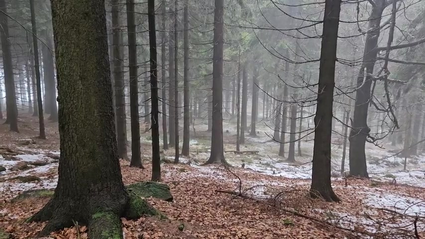
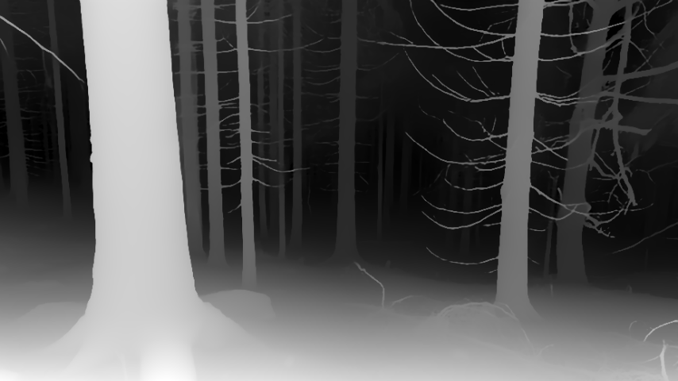

# Video-Depth Maps Installation

**Note**: We use `conda` environment to isolate builds, also it's easy to get rid of environments you don't need anymore. Here's the conda installation link: https://docs.conda.io/projects/conda/en/stable/user-guide/install/index.html

Typically something like:
```bash
wget https://repo.anaconda.com/miniconda/Miniconda3-latest-Linux-x86_64.sh
bash Miniconda3-latest-Linux-x86_64.sh
```

## Basic Setup

Create conda environment and install `depth-anything-v2`:

```bash
conda create -n video-depth python=3.12 -y
conda activate video-depth
pip install depth-anything-v2
pip install diffusers transformers accelerate
```


## Environment Verification and Troubleshooting

Now it's time  to verify that `pytorch` works with your graphics card:
```bash
python -c "import torch; print(torch.__version__); print(torch.cuda.get_arch_list()); print(torch.randn(1).cuda())"
```

should output something like this:
```
2.9.1+cu128
['sm_70', 'sm_75', 'sm_80', 'sm_86', 'sm_90', 'sm_100', 'sm_120']
tensor([0.4232], device='cuda:0')
```

If the output is like above (or similar, i.e. no errors shown, skip the following paragraph directly to _Creating the Depth Maps_ section)

### Troubleshooting Broken Versions Mismatch

Sometimes, if the graphics card is too new for some version of `nvcc` and `pytorch`, different output can be seen, e.g.:
```
NVIDIA GeForce RTX 5050 Laptop GPU with CUDA capability sm_120 is not compatible with the current PyTorch installation.
The current PyTorch install supports CUDA capabilities sm_50 sm_60 sm_70 sm_75 sm_80 sm_86 sm_90.
If you want to use the NVIDIA GeForce RTX 5050 Laptop GPU GPU with PyTorch, please check the instructions at https://pytorch.org/get-started/locally/

```

In that case we need to make sure that both  `nvacc` and `pytorch` support the architecture. Example for nvcc:
```bash
nvcc --version
nvcc --list-gpu-arch
```

Example output: 
```
nvcc: NVIDIA (R) Cuda compiler driver
Copyright (c) 2005-2024 NVIDIA Corporation
Built on Thu_Mar_28_02:18:24_PDT_2024
Cuda compilation tools, release 12.4, V12.4.131
Build cuda_12.4.r12.4/compiler.34097967_0
compute_50
compute_52
compute_53
compute_60
compute_61
compute_62
compute_70
compute_72
compute_75
compute_80
compute_86
compute_87
compute_89
compute_90
```

Since `compute_120` is not listed above we need to uninstall `pytorch` and  install proper cuda toolkit:
```bash
conda install -c "nvidia/label/cuda-12.8.0" cuda-toolkit
pip uninstall torch torchvision torchaudio -y
pip install torch torchvision # or specify version here
```

Now we should see `nvcc --version` and `nvcc --list-gpu-arch`:
```
compute_75
compute_80
compute_86
compute_87
compute_88
compute_89
compute_90
compute_100
compute_110
compute_103
compute_120
compute_121
```

Let's go back to "verify that pytorch works with gpu" and we should see the `sm_XXX` architecture.


## Creating the Depth Maps

Install the model by downloading it from huggingface:
```bash
mkdir -p checkpoints
cd checkpoints
wget https://huggingface.co/depth-anything/Depth-Anything-V2-Large/resolve/main/depth_anything_v2_vitl.pth
cd ..
```

Now running:
```bash
conda activate video-depth # unless already inside conda env
python video_depth.py  Scenes/20251202_130635.mp4/
```

will create folder `depth_maps_video/` in the directory where source `images/` are present.

## Depth Maps 

 Here is an example of source color image and it's corresponding depth map:


